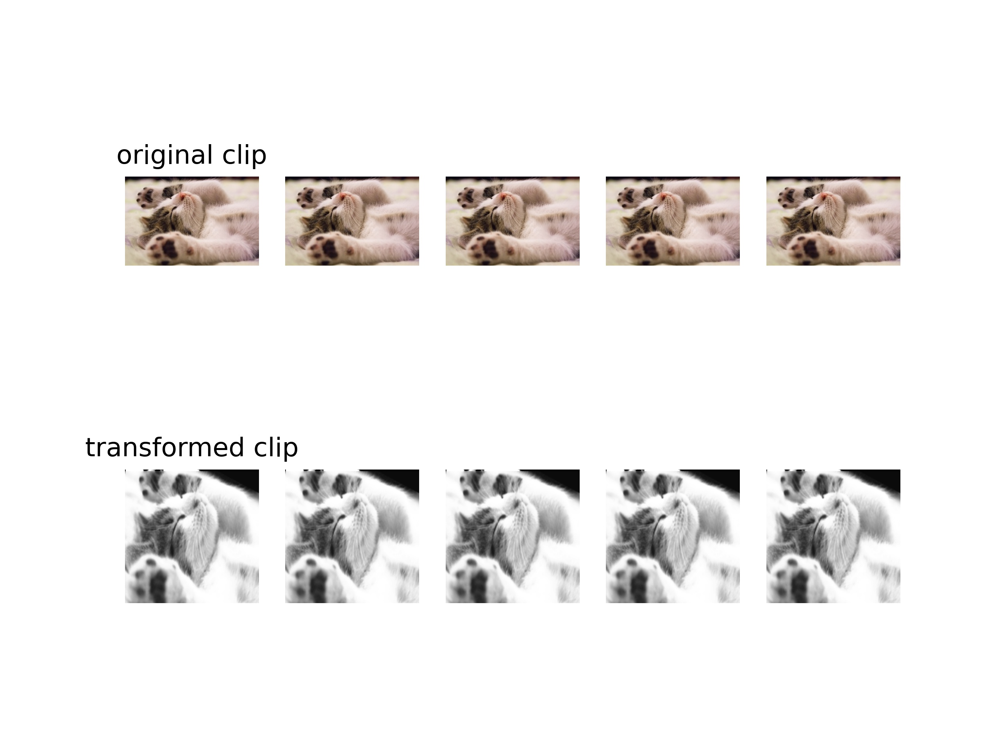

# videotransforms_opencv


## 1. Introduction
This repo is opencv accelerated video tensorform lib for pytorch. Part of this repo is modified from [opencv_transforms](https://github.com/jbohnslav/opencv_transforms) and [torch_videovision](https://github.com/hassony2/torch_videovision). 

As descirbed in [opencv_transforms](https://github.com/jbohnslav/opencv_transforms), opencv is faster than PIL in most cases, while torchvision offer a PIL based transforms to avoid BGR or RGB confusion(? refer to the [issue](https://github.com/pytorch/vision/pull/34) in torchvision repo.) 

Thanks jbohnslav's work in rewrite transform in opencv based, this repo is to expand it to video domain. As @jbohnslav mentioned, most transfroms would 1.5~4.0X faster than origin one.


## Function included
[x] Compose
[x] ToTensor
[x] ClipToTensor
[x] Lambda
[x] Normalize
[x] Resize
[x] RandomCrop
[x] CenterCrop
[x] RandomHorizontalFlip
[x] RandomVerticalFlip
[x] RandomResizedCrop
[x] TenCrop
[x] ColorJitter
[x] RandomRotation
[x] RandomGrayScale

## To Use it
```shell
pip install git+https://github.com/fjchange/opencv_videovision 
```

